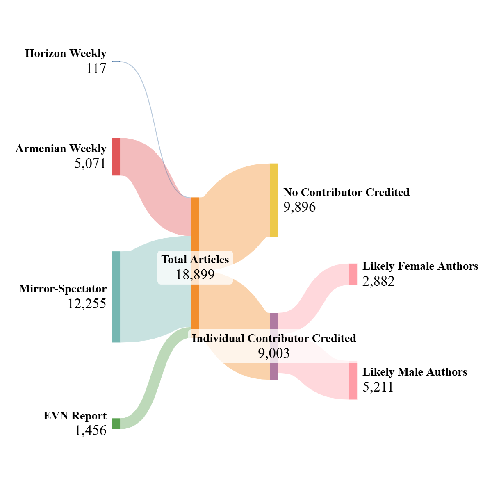
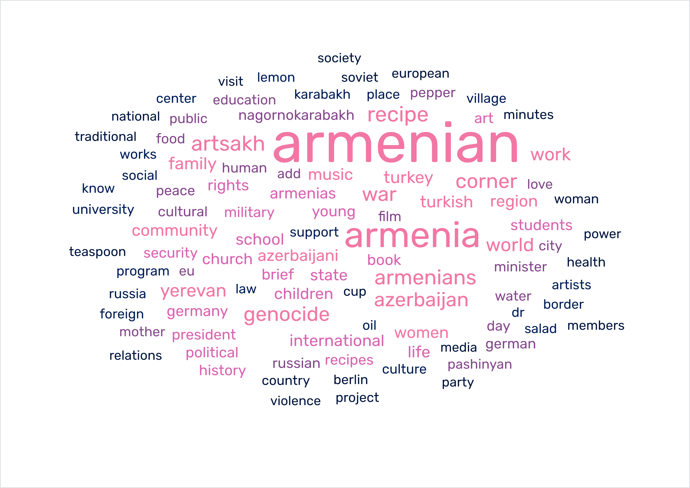
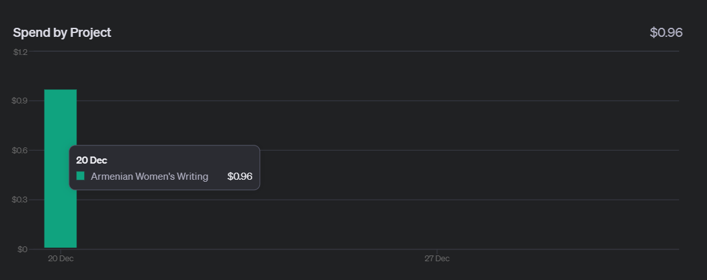
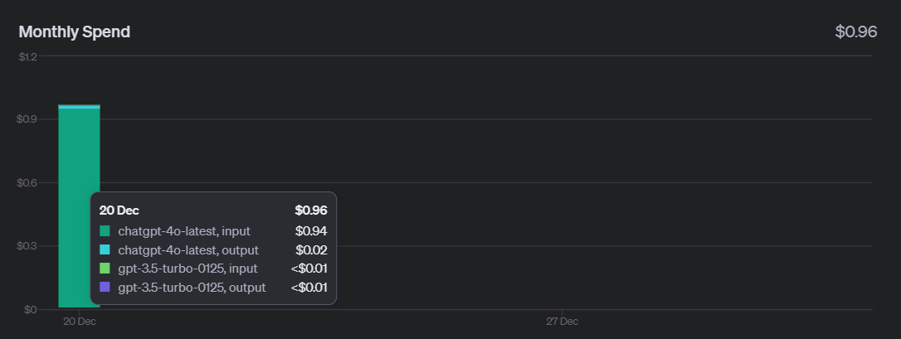

# Armenian Women's Writing Analysis   

## High-Level Overview of Dataset

Figure 1: Shows how many articles were scraped from each news website, and what number of articles had a female contributor credited.

Figure 2: Wordcloud of the most common keywords in Armenian women's articles.

[Back to Top](#armenian-womens-writing-analysis)

## What did English-language Armenian woman newspaper writers write about in the early 21st century?

As a monthly contributor for a bilingual Armenian newspaper in Toronto, I interviewed Dr. Victoria Rowe talking about her PhD dissertation on Armenian woman writers in the late 19th and early 20th centuries. Rowe's disseration was published at the University of Toronto in the year 2000 and available [here](https://utoronto.scholaris.ca/items/03f3f131-4d35-4027-a2fa-ec87ad406335). After our conversations, I was curious about the patterns in Armenian women's writing in the early 21st century.

Since I am an English-language Armenian woman newspaper writer, I decided to narrow the scope of my analysis to my counterparts primarily based in Canada, the US, and Armenia.

This project consisted of several stages:
- scraping data from a representative sample of popular Armenian news sites (read about [here](#data-scraping))
- data cleaning and pre-processing to ensure standardized, uniformly formatted outputs (read about [here](#data-cleaning))
- identifying (likely) women writers (read about [here](#determining-woman-authors-using-ai))
- data categorization and visualization (read about [here](#data-categorization-and-visualization))

The Tableau story visualizing the data can be accessed here ([link](https://public.tableau.com/shared/DDMWMJSRC?:display_count=n&:origin=viz_share_link)). Feel free to observe patterns yourself. I have committed to writing a Torontohye article with my own conclusions, publish date TBD.

[Back to Top](#armenian-womens-writing-analysis)

## Data Scraping

I decided to scrape 3 popular news sites fully and 1 Canadian news site partially. Data scraping was done in December 2024.

The Yerevan-based [EVN Report](https://evnreport.com/about-us/) is a fairly new non-profit, independent online magazine that features long-form deep dive essays on contemporary Armenian issues, written by both local Armenian writers and diasporans.

[The Armenian Weekly](https://armenianweekly.com/) and [The Armenian Mirror-Spectator](https://mirrorspectator.com/) are both older US-based Armenian diasporan papers. The former is traditionally affiliated with the Armenian Revolutionary Federation (ARF) political tendency, while the latter is associated with the Armenian Democratic Liberal Party (ADL), also commonly known as the Ramgavar Party.

In an attempt to create balance between political affiliations (since the Mirror-Spectator had a more thorough public online archive than the Armenian Weekly) and broaden some of the geographic diversity, I also scraped the opinion section of [Horizon Weekly](https://horizonweekly.ca/), a trilingual Canada-based newspaper that is the official publication of Canada's ARF Central Committee. The opinion section featured writing by individual contributors, which was what was needed for my purposes.

Webscrapers were created for each website using the following Python libraries: BeautifulSoup (an HTML parser), Newspaper3k (a library specifically for scraping news articles), requests (to send HTTP requests), and selenium (for navigating websites with inconsistent formatting patterns).    

Headers and random time delays were employed to simulate human browser requests and prevent rate limiting or being blocked.   

Data was saved to Excel spreadsheets using the openpyxl library. Information saved included each article's title, author, publish date, URL, and keywords generated through natural language processing (NLP).

[Back to Top](#armenian-womens-writing-analysis)

## Data Cleaning

With the article information compiled into Excel spreadsheets, I began to process and prepare the data to be analyzed. To do this, I employed a number of methods: Python scripts using pandas and other libraries, VBA scripts to automate Excel functions, and Excel formulas.

Since I had limited the scope of my analysis to analyzing English-language Armenian women's writing, I had to first remove any articles in French or Armenian. These were removed from the dataset scraped from Horizon Weekly, since the other publications were monolingual English publications.

My end goal was to sort the article data by author gender in order to analyze women's writing. Since it is a person's first name that indicates their likely gender, I needed to isolate the authors' first names.

My prcoess was complicated by the fact that many articles don't have any individual contributors credited. Instead, there is either no author listed; anonymous "guest contributors" credited; the newspaper editorial team collectively credited ("Weekly Staff", "The Armenian-Mirror Spectator"); or an organization credited (ANCA, ARS, Zoryan Institute, etc.). 

Since I wanted to analyze individual women's writing, I had to remove these entries from the dataset. 

Additionally, I needed the standardize the way authors' names were listed. Many authors' names were scraped with honorifics included (Dr., Rev., Fr., etc.). Some authors even had double honorifics listed. I standardized all author names into the same format, with just first names and last names. From this, I was able to isolate the authors' first names and begin sorting by gender.

[Back to Top](#armenian-womens-writing-analysis)

## Determining Woman Authors Using AI 

I would first like to address the potentially problematic elements of this project:     
- it assumes newspaper contributors fall into binary gender identities ("man" or "woman"), therefore failing to account for the possibility of contributors with non-binary gender identities.                  
- it assumes that the gender identity of newspaper authors is correlated with the commonly associated gender of their first names, therefore failing to account for gender non-conforming naming conventions (including gender neutral names like "Sam" and using first initials like "C. S. Lewis").     
- it only accounts for woman writers where the author is credited by name. Women who wrote submissions as part of collective statements of organizations or as part of editorial teams are not included in this analysis.

However, given that there is an academic tradition of "women's studies" and a large enough dataset that anomalies would not overwhelm, I still thought it was worthwhile to analyze the writing of *likely* Armenian woman writers.

My approach to determining gender was balancing two trade-offs: financial cost and accuracy.

Initially, I wanted to use this gendering API: https://gender-api.com/en/. They claim to have support for Canada, the USA, and Armenia, which are the main locations of the writers in my dataset.

Through testing their tool, I found that while it had over 95% accuracy for standard, anglophone North American names, it had less than 50% accuracy for ethnic Armenian names (likely because the model was trained on a biased sampling of data). Despite the poor accuracy, gendering my dataset would cost anywhere from $10 - $20 (CAD), depending on how I approached it.

Through my own testing, I realized that GPT models, when prompted correctly, can gender Armenian names with over 95% accuracy. I decided to use OpenAI's API for gendering the dataset using a chat model.

I first extracted all the unique first names from my dataset. Then, using few shot prompting/in-context learning, I gendered all the unique names and created a "dictionary" with which to gender the broader dataset. Through minimizing the number of tokens used, I was able to gender my entire dataset for under $1 (USD, using conversion rate at the time of project, under $1.44 CAD). This cost (less than a cup of coffee at Tim Horton's!) included testing stages and final implementation.

Chart 1: API spending by project

Chart 2: API spending by type of model used

Now, I had a set of article data by likely Armenian woman writers. I could begin visualizing this data to identify keyword trends.

[Back to Top](#armenian-womens-writing-analysis)

## Data Categorization and Visualization 

Once I had a set of article data by likely Armenian woman writers, I normalized it to having one keyword per line. I then began analyzing the keywords.

I employed a word cloud to easily visualize major keywords/themes. However, I was not satisfied with that level of analysis. I decided to look at the most frequently occuring keywords, and determine several categories to sort the keywords into for deeper analysis of what women were writing about when they discussed geographical locations, socio-political issues, and cultural matters.

Using the SentenceTransformers framework for natural language processing (NLP) from Hugging Face, I experimented with setting seed words for each category and a similarity threshhold to allow for sorting the keywords into a category most similar to them. Iterating on my learnings each time, I reached a point where there was accurate and meaningful categorization.

I then visualized each category using Tableau. This allowed me to see both the trend in overall use of category keywords year over year, and the different keywords used in each category. I have began interpreting some of the results in my Tableau story [here](https://public.tableau.com/shared/XTMNWXW2J?:display_count=n&:origin=viz_share_link).

I am looking forward to sharing my learnings from this project in Torontohye. 

[Back to Top](#armenian-womens-writing-analysis)

## Credits/Contact

This project was envisioned, researched, and created by Sophia Alexanian (me!). I am an electrical engineering student at the University of Toronto (UofT ECE 2T7+PEY), and a monthly contributor for Torontohye, Toronto's bilingual Armenian newspaper.  
I can be reached here:  
LinkedIn: https://www.linkedin.com/in/sophia-alexanian/   
Email: sophia.alexanian@mail.utoronto.ca  

It was a joy to combine my technical skills with my passion for Armenian women's writing. This project showcases my unique skillset and interests in computer programming, data processing/storytelling, and ethnic women's studies.

Beyond my personal knowledge, since any coding project is made better with external input, I also had some quick check-ins with some other folks I'd like to acknowledge.

Thank you to [Dr. Khatchig Mouradian](https://mesaas.columbia.edu/faculty-directory/khatchig-mouradian/), a professor at Columbia University and the Armenian and Georgian Area Specialist at the Library of Congress, for encouraging work "at the intersection of the Humanities and AI" when we spoke about Victoria Rowe and the future of Armenian studies. 

A BIG thank you to [Khasir Hean](https://www.linkedin.com/in/khasir-hean/), a data scientist/ML engineer (and graduate of UofT's Masters of Applied Computing program), for providing an initial consult about webscrapers. 

Thank you to [Emerson Schryver](https://www.linkedin.com/in/eschry/), a fellow UofT student and CSSU regular, for helping me approach debugging one of the scrapers.

I also extend gratitude to [Robert Zupancic](https://www.linkedin.com/in/robert-zupancic/), a fellow UofT engineering student (and my ECE241 lab partner), for doing a final code review.

P.S. Robert and I created a piano and drum kit simulator for FPGA using Verilog for our final ECE241 project. If you're interested in seeing my work in a hardware description language (as opposed to a high-level programming language), feel free to check out our (censored for academic integrity purposes) work [here](https://github.com/RoZ4/Pianissimo-for-the-FPGA).

[Back to Top](#armenian-womens-writing-analysis)

